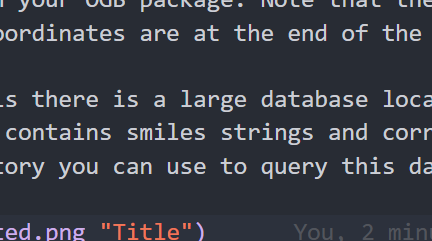

All data hosted on Dive3 server.

### OGB-LSC Dataset with 3D information

There is a pytorch geometric compatible version of the OGB-LSC dataset augmented with 3D information located at **/data3/kaleb.dickerson2001/Datasets/OGB-LSC-3D**. This should already be processed and be compatible with your OGB package. Note that the number of features per node is now 12 (from 9). The x, y, and z coordinates are at the end of the feature vector.

In addition to this there is a large database located at **/data3/kaleb.dickerson2001/Datasets/PubChem3D** which contains smiles strings and corresponding coordinates. There is also a simple API in the same directory you can use to query this database with the smiles string and recieve the coodinates as an array of tuples. -1 indicates that smiles string was not found in database.

